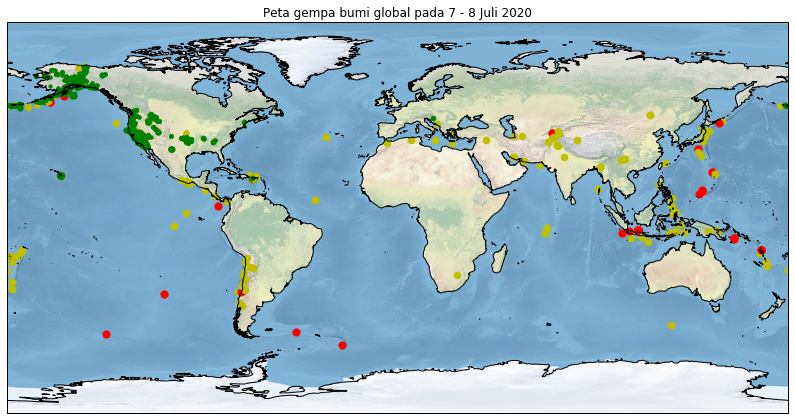

# Menampilkan peta gempa hari ini

<p style="text-align:justify">Sebagai penutup, penyusun akan mengajak sidang pembaca (yang umumnya dari kalangan geosains) untuk melakukan kegiatan pemetaan gempa selama 24 jam terakhir dari data USGS. Diharapkan modul ini akan membantu pembaca untuk mengaplikasikan materi pembelajaran Cartopy pada bidang keilmuannya masing - masing.</p>

<p style="text-align:justify">Untuk memulai proyek mini ini, kita wajib mengimpor tiga buah pustaka Python, yakni: pandas (untuk membaca data tabular), matplotlib (untuk visualisasi), dan Cartopy (untuk pemetaan).</p>


```python
import pandas as pd
import matplotlib
import cartopy.crs as ccrs
```

Selain itu, kita juga perlu mengatur tampilan plot agar tampak lebih estetik.


```python
%matplotlib inline
matplotlib.rcParams['figure.figsize'] = (14,10)
```

Kita membaca data tabular secara *remote* dengan menggunakan pandas.


```python
df = pd.read_csv('http://earthquake.usgs.gov/earthquakes/feed/v1.0/summary/1.0_week.csv')
df.head()
```


<div>
<style scoped>
    .dataframe tbody tr th:only-of-type {
        vertical-align: middle;
    }

    .dataframe tbody tr th {
        vertical-align: top;
    }

    .dataframe thead th {
        text-align: right;
    }
</style>
<table border="1" class="dataframe">
  <thead>
    <tr style="text-align: right;">
      <th></th>
      <th>time</th>
      <th>latitude</th>
      <th>longitude</th>
      <th>depth</th>
      <th>mag</th>
      <th>magType</th>
      <th>nst</th>
      <th>gap</th>
      <th>dmin</th>
      <th>rms</th>
      <th>...</th>
      <th>updated</th>
      <th>place</th>
      <th>type</th>
      <th>horizontalError</th>
      <th>depthError</th>
      <th>magError</th>
      <th>magNst</th>
      <th>status</th>
      <th>locationSource</th>
      <th>magSource</th>
    </tr>
  </thead>
  <tbody>
    <tr>
      <th>0</th>
      <td>2020-07-08T03:41:44.072Z</td>
      <td>59.784700</td>
      <td>-147.979000</td>
      <td>11.60</td>
      <td>2.10</td>
      <td>ml</td>
      <td>NaN</td>
      <td>NaN</td>
      <td>NaN</td>
      <td>1.03</td>
      <td>...</td>
      <td>2020-07-08T03:45:41.403Z</td>
      <td>31 km S of Chenega, Alaska</td>
      <td>earthquake</td>
      <td>NaN</td>
      <td>0.30</td>
      <td>NaN</td>
      <td>NaN</td>
      <td>automatic</td>
      <td>ak</td>
      <td>ak</td>
    </tr>
    <tr>
      <th>1</th>
      <td>2020-07-08T03:40:25.570Z</td>
      <td>35.590500</td>
      <td>-117.378998</td>
      <td>5.57</td>
      <td>1.71</td>
      <td>ml</td>
      <td>34.0</td>
      <td>74.00</td>
      <td>0.06646</td>
      <td>0.17</td>
      <td>...</td>
      <td>2020-07-08T03:44:13.076Z</td>
      <td>19km S of Trona, CA</td>
      <td>earthquake</td>
      <td>0.31</td>
      <td>0.99</td>
      <td>0.184</td>
      <td>17.0</td>
      <td>automatic</td>
      <td>ci</td>
      <td>ci</td>
    </tr>
    <tr>
      <th>2</th>
      <td>2020-07-08T03:39:58.030Z</td>
      <td>34.085500</td>
      <td>-117.987667</td>
      <td>14.46</td>
      <td>1.21</td>
      <td>ml</td>
      <td>16.0</td>
      <td>54.00</td>
      <td>0.08178</td>
      <td>0.25</td>
      <td>...</td>
      <td>2020-07-08T03:43:46.737Z</td>
      <td>2km W of Baldwin Park, CA</td>
      <td>earthquake</td>
      <td>0.56</td>
      <td>1.08</td>
      <td>0.237</td>
      <td>30.0</td>
      <td>automatic</td>
      <td>ci</td>
      <td>ci</td>
    </tr>
    <tr>
      <th>3</th>
      <td>2020-07-08T03:34:27.830Z</td>
      <td>38.167300</td>
      <td>-117.881800</td>
      <td>12.30</td>
      <td>1.10</td>
      <td>ml</td>
      <td>15.0</td>
      <td>113.14</td>
      <td>0.01600</td>
      <td>0.05</td>
      <td>...</td>
      <td>2020-07-08T03:41:09.513Z</td>
      <td>31 km SE of Mina, Nevada</td>
      <td>earthquake</td>
      <td>NaN</td>
      <td>0.60</td>
      <td>NaN</td>
      <td>NaN</td>
      <td>automatic</td>
      <td>nn</td>
      <td>nn</td>
    </tr>
    <tr>
      <th>4</th>
      <td>2020-07-08T03:31:41.640Z</td>
      <td>35.860333</td>
      <td>-117.698500</td>
      <td>5.62</td>
      <td>1.46</td>
      <td>ml</td>
      <td>18.0</td>
      <td>60.00</td>
      <td>0.07469</td>
      <td>0.18</td>
      <td>...</td>
      <td>2020-07-08T03:35:35.013Z</td>
      <td>21km ESE of Little Lake, CA</td>
      <td>earthquake</td>
      <td>0.35</td>
      <td>0.93</td>
      <td>0.113</td>
      <td>17.0</td>
      <td>automatic</td>
      <td>ci</td>
      <td>ci</td>
    </tr>
  </tbody>
</table>
<p>5 rows × 22 columns</p>
</div>


Karena kolom time belum berupa objek datetime, maka kita perlu melakukan konversi sebagai berikut: 


```python
df['time'] = pd.to_datetime(df['time'])
type(df['time'][1])
```


    pandas._libs.tslibs.timestamps.Timestamp


```python
df.head()
```


<div>
<style scoped>
    .dataframe tbody tr th:only-of-type {
        vertical-align: middle;
    }

    .dataframe tbody tr th {
        vertical-align: top;
    }

    .dataframe thead th {
        text-align: right;
    }
</style>
<table border="1" class="dataframe">
  <thead>
    <tr style="text-align: right;">
      <th></th>
      <th>time</th>
      <th>latitude</th>
      <th>longitude</th>
      <th>depth</th>
      <th>mag</th>
      <th>magType</th>
      <th>nst</th>
      <th>gap</th>
      <th>dmin</th>
      <th>rms</th>
      <th>...</th>
      <th>updated</th>
      <th>place</th>
      <th>type</th>
      <th>horizontalError</th>
      <th>depthError</th>
      <th>magError</th>
      <th>magNst</th>
      <th>status</th>
      <th>locationSource</th>
      <th>magSource</th>
    </tr>
  </thead>
  <tbody>
    <tr>
      <th>0</th>
      <td>2020-07-08 03:41:44.072000+00:00</td>
      <td>59.784700</td>
      <td>-147.979000</td>
      <td>11.60</td>
      <td>2.10</td>
      <td>ml</td>
      <td>NaN</td>
      <td>NaN</td>
      <td>NaN</td>
      <td>1.03</td>
      <td>...</td>
      <td>2020-07-08T03:45:41.403Z</td>
      <td>31 km S of Chenega, Alaska</td>
      <td>earthquake</td>
      <td>NaN</td>
      <td>0.30</td>
      <td>NaN</td>
      <td>NaN</td>
      <td>automatic</td>
      <td>ak</td>
      <td>ak</td>
    </tr>
    <tr>
      <th>1</th>
      <td>2020-07-08 03:40:25.570000+00:00</td>
      <td>35.590500</td>
      <td>-117.378998</td>
      <td>5.57</td>
      <td>1.71</td>
      <td>ml</td>
      <td>34.0</td>
      <td>74.00</td>
      <td>0.06646</td>
      <td>0.17</td>
      <td>...</td>
      <td>2020-07-08T03:44:13.076Z</td>
      <td>19km S of Trona, CA</td>
      <td>earthquake</td>
      <td>0.31</td>
      <td>0.99</td>
      <td>0.184</td>
      <td>17.0</td>
      <td>automatic</td>
      <td>ci</td>
      <td>ci</td>
    </tr>
    <tr>
      <th>2</th>
      <td>2020-07-08 03:39:58.030000+00:00</td>
      <td>34.085500</td>
      <td>-117.987667</td>
      <td>14.46</td>
      <td>1.21</td>
      <td>ml</td>
      <td>16.0</td>
      <td>54.00</td>
      <td>0.08178</td>
      <td>0.25</td>
      <td>...</td>
      <td>2020-07-08T03:43:46.737Z</td>
      <td>2km W of Baldwin Park, CA</td>
      <td>earthquake</td>
      <td>0.56</td>
      <td>1.08</td>
      <td>0.237</td>
      <td>30.0</td>
      <td>automatic</td>
      <td>ci</td>
      <td>ci</td>
    </tr>
    <tr>
      <th>3</th>
      <td>2020-07-08 03:34:27.830000+00:00</td>
      <td>38.167300</td>
      <td>-117.881800</td>
      <td>12.30</td>
      <td>1.10</td>
      <td>ml</td>
      <td>15.0</td>
      <td>113.14</td>
      <td>0.01600</td>
      <td>0.05</td>
      <td>...</td>
      <td>2020-07-08T03:41:09.513Z</td>
      <td>31 km SE of Mina, Nevada</td>
      <td>earthquake</td>
      <td>NaN</td>
      <td>0.60</td>
      <td>NaN</td>
      <td>NaN</td>
      <td>automatic</td>
      <td>nn</td>
      <td>nn</td>
    </tr>
    <tr>
      <th>4</th>
      <td>2020-07-08 03:31:41.640000+00:00</td>
      <td>35.860333</td>
      <td>-117.698500</td>
      <td>5.62</td>
      <td>1.46</td>
      <td>ml</td>
      <td>18.0</td>
      <td>60.00</td>
      <td>0.07469</td>
      <td>0.18</td>
      <td>...</td>
      <td>2020-07-08T03:35:35.013Z</td>
      <td>21km ESE of Little Lake, CA</td>
      <td>earthquake</td>
      <td>0.35</td>
      <td>0.93</td>
      <td>0.113</td>
      <td>17.0</td>
      <td>automatic</td>
      <td>ci</td>
      <td>ci</td>
    </tr>
  </tbody>
</table>
<p>5 rows × 22 columns</p>
</div>


<p style="text-align:justify">Untuk mendapatkan data gempa hari ini, kita perlu melakukan operasi <i>masking</i>. Sebagai catatan, Notebook ini dibuat pada tanggal 8 Juli 2020. Oleh karena itu, penyusun akan melakukan <i>masking</i> waktu dari tanggal 7 hingga 8 Juli 2020 (hal ini patut disesuaikan oleh pembaca).</p> 


```python
mask = ((df['time'] >= '2020-07-07') & (df['time'] < '2020-07-08'))
gempaHariIni = df.loc[mask]
gempaHariIni.head()
```


<div>
<style scoped>
    .dataframe tbody tr th:only-of-type {
        vertical-align: middle;
    }

    .dataframe tbody tr th {
        vertical-align: top;
    }

    .dataframe thead th {
        text-align: right;
    }
</style>
<table border="1" class="dataframe">
  <thead>
    <tr style="text-align: right;">
      <th></th>
      <th>time</th>
      <th>latitude</th>
      <th>longitude</th>
      <th>depth</th>
      <th>mag</th>
      <th>magType</th>
      <th>nst</th>
      <th>gap</th>
      <th>dmin</th>
      <th>rms</th>
      <th>...</th>
      <th>updated</th>
      <th>place</th>
      <th>type</th>
      <th>horizontalError</th>
      <th>depthError</th>
      <th>magError</th>
      <th>magNst</th>
      <th>status</th>
      <th>locationSource</th>
      <th>magSource</th>
    </tr>
  </thead>
  <tbody>
    <tr>
      <th>41</th>
      <td>2020-07-07 23:51:01.840000+00:00</td>
      <td>19.364666</td>
      <td>-155.218506</td>
      <td>-0.19</td>
      <td>1.89</td>
      <td>ml</td>
      <td>19.0</td>
      <td>113.0</td>
      <td>NaN</td>
      <td>0.12</td>
      <td>...</td>
      <td>2020-07-07T23:56:39.490Z</td>
      <td>8 km S of Volcano, Hawaii</td>
      <td>earthquake</td>
      <td>0.33</td>
      <td>0.38</td>
      <td>0.260</td>
      <td>4.0</td>
      <td>automatic</td>
      <td>hv</td>
      <td>hv</td>
    </tr>
    <tr>
      <th>42</th>
      <td>2020-07-07 23:50:59.200000+00:00</td>
      <td>19.355000</td>
      <td>-155.219330</td>
      <td>-0.99</td>
      <td>1.89</td>
      <td>ml</td>
      <td>13.0</td>
      <td>122.0</td>
      <td>NaN</td>
      <td>0.22</td>
      <td>...</td>
      <td>2020-07-07T23:56:32.460Z</td>
      <td>9 km S of Volcano, Hawaii</td>
      <td>earthquake</td>
      <td>0.33</td>
      <td>0.49</td>
      <td>0.260</td>
      <td>4.0</td>
      <td>automatic</td>
      <td>hv</td>
      <td>hv</td>
    </tr>
    <tr>
      <th>43</th>
      <td>2020-07-07 23:49:48.779000+00:00</td>
      <td>63.196800</td>
      <td>-151.112400</td>
      <td>0.00</td>
      <td>1.00</td>
      <td>ml</td>
      <td>NaN</td>
      <td>NaN</td>
      <td>NaN</td>
      <td>0.77</td>
      <td>...</td>
      <td>2020-07-07T23:52:51.616Z</td>
      <td>49 km SE of Denali National Park, Alaska</td>
      <td>earthquake</td>
      <td>NaN</td>
      <td>0.50</td>
      <td>NaN</td>
      <td>NaN</td>
      <td>automatic</td>
      <td>ak</td>
      <td>ak</td>
    </tr>
    <tr>
      <th>44</th>
      <td>2020-07-07 23:49:28.655000+00:00</td>
      <td>12.982600</td>
      <td>92.409200</td>
      <td>10.00</td>
      <td>4.60</td>
      <td>mb</td>
      <td>NaN</td>
      <td>84.0</td>
      <td>1.358</td>
      <td>1.21</td>
      <td>...</td>
      <td>2020-07-08T00:19:28.040Z</td>
      <td>145 km NNW of Bamboo Flat, India</td>
      <td>earthquake</td>
      <td>8.70</td>
      <td>1.90</td>
      <td>0.091</td>
      <td>36.0</td>
      <td>reviewed</td>
      <td>us</td>
      <td>us</td>
    </tr>
    <tr>
      <th>45</th>
      <td>2020-07-07 23:31:29.865000+00:00</td>
      <td>63.560000</td>
      <td>-147.489600</td>
      <td>64.70</td>
      <td>1.40</td>
      <td>ml</td>
      <td>NaN</td>
      <td>NaN</td>
      <td>NaN</td>
      <td>0.51</td>
      <td>...</td>
      <td>2020-07-07T23:36:07.686Z</td>
      <td>73 km ESE of McKinley Park, Alaska</td>
      <td>earthquake</td>
      <td>NaN</td>
      <td>0.90</td>
      <td>NaN</td>
      <td>NaN</td>
      <td>automatic</td>
      <td>ak</td>
      <td>ak</td>
    </tr>
  </tbody>
</table>
<p>5 rows × 22 columns</p>
</div>


Kita dapat mengetahui besaran gempa maksimum dan minimum yang terjadi secara global pada hari ini dengan menggunakan perintah sebagai berikut:


```python
print(df[df['mag'] == df['mag'].min()]) # besaran gempa minimum
```

                                     time   latitude   longitude  depth   mag  \
    216  2020-07-07 06:30:21.850000+00:00  33.352000 -116.359833  10.90  0.95   
    245  2020-07-07 03:55:13.260000+00:00  34.126833 -117.478167   5.23  0.95   
    731  2020-07-05 09:58:50.190000+00:00  37.652500 -118.892333   2.60  0.95   
    761  2020-07-05 06:58:02.870000+00:00  33.509167 -116.480000  13.75  0.95   
    865  2020-07-04 21:18:50.110000+00:00  34.465333 -117.966000   8.39  0.95   
    1400 2020-07-03 04:03:31.650000+00:00  53.860333 -166.751167   8.12  0.95   
    1434 2020-07-03 02:08:45.240000+00:00  33.580833 -116.801667   7.10  0.95   
    1571 2020-07-02 17:50:28.090000+00:00  37.461833 -118.727500   4.54  0.95   
    1766 2020-07-02 05:51:54.490000+00:00  33.334500 -116.187333   8.11  0.95   
    
         magType   nst    gap      dmin   rms  ...                   updated  \
    216       ml  34.0   68.0  0.043300  0.23  ...  2020-07-07T06:34:03.667Z   
    245       ml  15.0  123.0  0.097480  0.13  ...  2020-07-07T03:58:59.157Z   
    731       md  19.0   87.0  0.008846  0.08  ...  2020-07-06T17:02:03.770Z   
    761       ml  36.0   63.0  0.064330  0.17  ...  2020-07-06T14:26:40.280Z   
    865       ml  19.0   55.0  0.018550  0.08  ...  2020-07-07T20:34:43.089Z   
    1400      ml   6.0  102.0  0.044930  0.09  ...  2020-07-06T18:12:24.430Z   
    1434      ml  38.0   28.0  0.033880  0.21  ...  2020-07-03T15:07:33.230Z   
    1571      md  15.0  156.0  0.151300  0.03  ...  2020-07-02T18:51:05.078Z   
    1766      ml  29.0  120.0  0.106000  0.24  ...  2020-07-02T05:55:50.184Z   
    
                                      place        type horizontalError  \
    216       11km N of Borrego Springs, CA  earthquake            0.33   
    245              4km NNW of Fontana, CA  earthquake            0.45   
    731        8km ENE of Mammoth Lakes, CA  earthquake            0.38   
    761                19km ESE of Anza, CA  earthquake            0.24   
    865           6km SSE of Littlerock, CA  earthquake            0.14   
    1400  14 km WSW of Dutch Harbor, Alaska  earthquake            0.35   
    1434               12km WNW of Anza, CA  earthquake            0.27   
    1571         12km SSW of Toms Place, CA  earthquake            0.46   
    1766              17km SSW of Oasis, CA  earthquake            0.39   
    
         depthError  magError  magNst     status  locationSource magSource  
    216        0.56     0.158    24.0  automatic              ci        ci  
    245        1.24     0.324    18.0  automatic              ci        ci  
    731        0.29     0.254    15.0   reviewed              nc        nc  
    761        0.45     0.180    28.0   reviewed              ci        ci  
    865        0.25     0.153    13.0   reviewed              ci        ci  
    1400       0.62     0.245     6.0   reviewed              av        av  
    1434       0.74     0.151    27.0   reviewed              ci        ci  
    1571       2.63     0.245    13.0   reviewed              nc        nc  
    1766       1.82     0.124    21.0  automatic              ci        ci  
    
    [9 rows x 22 columns]


```python
print(df[df['mag'] == df['mag'].max()])
```

                                    time  latitude  longitude   depth  mag  \
    313 2020-07-06 22:54:46.856000+00:00   -5.6368   110.6783  528.66  6.6   
    
        magType  nst   gap   dmin   rms  ...                   updated  \
    313     mww  NaN  20.0  1.422  0.92  ...  2020-07-07T23:00:40.068Z   
    
                                place        type horizontalError depthError  \
    313  93 km N of Batang, Indonesia  earthquake             8.3        6.4   
    
         magError  magNst    status  locationSource magSource  
    313     0.068    21.0  reviewed              us        us  
    
    [1 rows x 22 columns]


Sesudah itu, kita akan mengekstraksi data bujur, lintang, dan besaran gempa (dalam skala Richter) dalam bentuk objek *list*:


```python
bujur = list(df['longitude'])
lintang = list(df['latitude'])
besaran = list(df['mag'])
```

<p style="text-align:justify">Kemudian kita akan mengklasifikasikan titik - titik gempa dengan menggunakan warna - warna tertentu (hijau untuk gempa di bawah 3 SR, kuning untuk gempa dengan rentang 3 - 5 SR, dan merah untuk gempa di atas 5 SR) dengan menggunakan fungsi sebagai berikut:</p>


```python
def warna(besaran):
    if besaran < 3.0:
        return 'g'
    elif 3.0 <= besaran < 5.0:
        return 'y'
    else:
        return 'r'
```

Kemudian kita tinggal melakukan pemetaan dengan menggunakan Cartopy:


```python
ax = plt.axes(projection = ccrs.PlateCarree())
ax.coastlines(resolution='50m')
ax.stock_img()

for i in range(len(besaran)):
    warnaEpi = warna(besaran[i])
    plt.scatter(bujur[i], lintang[i], s=besaran[i]*10, c=warnaEpi)

plt.title('Peta gempa bumi global pada 7 - 8 Juli 2020');
```




